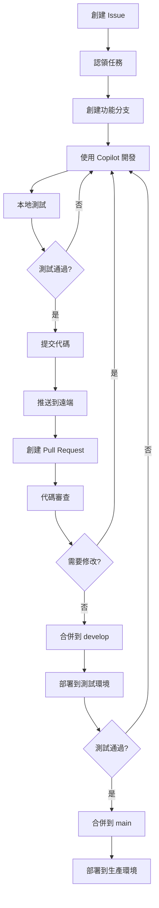

# 專案架構說明

## 🏗️ 系統架構

### 整體架構圖

```
┌─────────────────────────────────────────────────────────────┐
│                     GitHub 儲存庫 (main)                      │
│                    https://github.com/...                    │
└───────────────────────┬─────────────────────────────────────┘
                        │
        ┌───────────────┼───────────────┐
        │               │               │
        ▼               ▼               ▼
┌───────────────┐ ┌───────────────┐ ┌───────────────┐
│   設備 A      │ │   設備 B      │ │   設備 C      │
│  (開發者 1)   │ │  (開發者 2)   │ │  (開發者 3)   │
├───────────────┤ ├───────────────┤ ├───────────────┤
│ VSCode +      │ │ VSCode +      │ │ VSCode +      │
│ Copilot       │ │ Copilot       │ │ Copilot       │
├───────────────┤ ├───────────────┤ ├───────────────┤
│ 本地分支      │ │ 本地分支      │ │ 本地分支      │
│ feature-a     │ │ feature-b     │ │ test-*        │
└───────────────┘ └───────────────┘ └───────────────┘
        │               │               │
        └───────────────┼───────────────┘
                        │
                        ▼
            ┌─────────────────────┐
            │   Pull Requests     │
            │   Code Reviews      │
            │   CI/CD Pipeline    │
            └─────────────────────┘
```

## 📂 專案結構

```
team-project/
│
├── .github/                    # GitHub 配置
│   ├── workflows/              # GitHub Actions (CI/CD)
│   │   └── ci.yml              # 持續整合配置
│   ├── ISSUE_TEMPLATE/         # Issue 模板
│   │   ├── bug_report.md       # Bug 報告模板
│   │   └── feature_request.md  # 功能請求模板
│   └── pull_request_template.md # PR 模板
│
├── .vscode/                    # VSCode 配置
│   ├── settings.json           # 工作區設定
│   ├── extensions.json         # 推薦擴展列表
│   └── launch.json             # 調試配置（可選）
│
├── src/                        # 源代碼目錄
│   ├── controllers/            # 控制器（API 邏輯）
│   ├── models/                 # 數據模型
│   ├── routes/                 # 路由定義
│   ├── middleware/             # 中間件
│   ├── services/               # 業務邏輯服務
│   ├── utils/                  # 工具函數
│   ├── config/                 # 配置文件
│   ├── index.js                # 應用入口
│   └── *.test.js               # 測試文件
│
├── tests/                      # 測試目錄（可選）
│   ├── unit/                   # 單元測試
│   ├── integration/            # 整合測試
│   └── e2e/                    # 端到端測試
│
├── docs/                       # 文檔目錄
│   ├── api/                    # API 文檔
│   └── architecture/           # 架構文檔
│
├── scripts/                    # 腳本目錄
│   ├── deploy.sh               # 部署腳本
│   └── setup.ps1               # 設置腳本
│
├── .env.example                # 環境變數範例
├── .gitignore                  # Git 忽略規則
├── .gitattributes              # Git 屬性
├── .eslintrc.json              # ESLint 配置
├── .prettierrc.json            # Prettier 配置
├── .commitlintrc.json          # Commit lint 配置
├── jest.config.js              # Jest 測試配置
├── jest.setup.js               # Jest 設置文件
├── package.json                # NPM 配置
├── package-lock.json           # NPM 鎖定文件
│
├── README.md                   # 主要文檔
├── QUICKSTART.md               # 快速開始指南
├── WORKFLOW.md                 # 工作流程文檔
├── COPILOT_PROMPTS.md          # Copilot 提示詞庫
├── CONTRIBUTING.md             # 貢獻指南
└── ARCHITECTURE.md             # 本文件
```

## 🔄 協作工作流程

### 1. 分支策略（Git Flow）

```
main (生產分支)
  │
  ├─── develop (開發分支)
  │      │
  │      ├─── feature/user-auth (設備 A)
  │      │      └─── 實作認證功能
  │      │
  │      ├─── feature/api-endpoints (設備 B)
  │      │      └─── 實作 API 端點
  │      │
  │      └─── test/integration (設備 C)
  │             └─── 添加整合測試
  │
  └─── hotfix/security-patch
         └─── 緊急安全修復
```

### 2. 開發流程圖



### 3. Pull Request 流程

```
開發者 A (提交者)          開發者 B (審查者)          開發者 C (測試者)
     │                          │                          │
     ├─ 創建 PR                 │                          │
     │                          │                          │
     │                          ├─ 審查代碼                │
     │                          ├─ 使用 Copilot 檢查       │
     │                          ├─ 提供反饋                │
     │                          │                          │
     ├─ 修改代碼                │                          │
     ├─ 推送更新                │                          │
     │                          │                          │
     │                          ├─ 再次審查                │
     │                          ├─ 批准 PR                 │
     │                          │                          │
     │                          │                          ├─ 拉取分支
     │                          │                          ├─ 運行測試
     │                          │                          ├─ 確認功能
     │                          │                          │
     ├─ 合併 PR ◄───────────────┴──────────────────────────┘
     │
     └─ 關閉 Issue
```

## 🤖 Copilot 協作模式

### 模式 1：並行開發

```
時間線        設備 A            設備 B            設備 C
─────────────────────────────────────────────────────────
09:00      開發認證功能      開發 API 端點      規劃測試策略
           @workspace       @workspace        @workspace
           實作登入          實作用戶 CRUD      分析測試需求

11:00      提交 PR          開發支付功能      為認證生成測試
           等待審查          @workspace        @workspace
                            整合支付閘道       添加單元測試

14:00      審查 B 的代碼     審查 C 的測試     提交測試 PR
           @workspace       @workspace        等待審查
           代碼審查          審查測試覆蓋

16:00      合併 PR          合併 PR          合併 PR
```

### 模式 2：接力開發

```
階段 1: 設備 A - 基礎實作
└─ @workspace 創建專案結構和基礎 API

階段 2: 設備 B - 功能擴展
└─ @workspace 基於 A 的基礎添加業務邏輯

階段 3: 設備 C - 測試和優化
└─ @workspace 為 A 和 B 的代碼生成測試並優化
```

### 模式 3：結對編程（Live Share）

```
主持人（設備 A）          參與者（設備 B,C）
    │                           │
    ├─ 啟動 Live Share          │
    │                           │
    │  ◄────────────────────────├─ 加入會話
    │                           │
    ├─ 共享編輯                 │
    │  使用各自的 Copilot        ├─ 即時協作
    │  討論並實作                │  提供建議
    │                           │
    └─ 結束會話並提交            └─ 審查最終代碼
```

## 🔐 安全和權限

### GitHub 權限設置

```
組織/儲存庫
├── Admin (團隊領導)
│   └── 可以修改所有設置、合併 PR
│
├── Write (所有開發者)
│   ├── 可以推送分支
│   ├── 可以創建 PR
│   └── 可以審查代碼
│
└── Read (外部貢獻者)
    └── 可以查看代碼、創建 Issue
```

### 分支保護規則

```yaml
main 分支:
  - 需要 PR 才能合併
  - 需要至少 1 個審查者批准
  - 需要 CI 檢查通過
  - 禁止強制推送
  - 禁止刪除

develop 分支:
  - 需要 PR 才能合併
  - 建議審查但不強制
  - 需要 CI 檢查通過
```

## 🧪 測試策略

### 測試金字塔

```
           ╱───────────╲
          ╱   E2E Tests  ╲       (少量，慢速，高成本)
         ╱───────────────╲
        ╱  Integration     ╲     (中等數量，中速)
       ╱─────── Tests ──────╲
      ╱   Unit Tests         ╲   (大量，快速，低成本)
     ╱─────────────────────────╲
```

### 測試責任分配

```
設備 A: 單元測試（自己的代碼）
└─ @workspace 為這個函數生成單元測試

設備 B: 整合測試（模組間互動）
└─ @workspace 生成 API 端點的整合測試

設備 C: E2E 測試（完整流程）
└─ @workspace 創建用戶註冊到登入的 E2E 測試
```

## 📊 CI/CD 流程

```
推送代碼
    │
    ├─→ GitHub Actions 觸發
    │
    ├─→ 安裝依賴
    │   └─ npm install
    │
    ├─→ 代碼檢查
    │   ├─ ESLint
    │   └─ Prettier
    │
    ├─→ 運行測試
    │   ├─ Unit Tests
    │   ├─ Integration Tests
    │   └─ 生成覆蓋率報告
    │
    ├─→ 構建應用
    │   └─ npm run build
    │
    └─→ 部署（如果是 main 分支）
        ├─ 部署到測試環境
        └─ 部署到生產環境
```

## 💡 最佳實踐

### 1. 代碼組織

```javascript
// ✅ 好的範例：單一職責
// user.controller.js
export const getUser = async (req, res) => {
  const user = await userService.findById(req.params.id);
  res.json(user);
};

// user.service.js
export const findById = async (id) => {
  return await User.findById(id);
};
```

### 2. Copilot 使用

```
✅ 好的提示詞：具體、清晰
"@workspace 實作用戶認證 middleware，檢查 JWT token 有效性，
並將用戶資訊附加到 req.user"

❌ 不好的提示詞：模糊、不清楚
"@workspace 做認證"
```

### 3. Git 提交

```bash
# ✅ 好的提交
git commit -m "feat(auth): add JWT authentication middleware

- Verify JWT token from Authorization header
- Extract user info from token
- Attach user to request object
- Handle token expiration

Closes #123"

# ❌ 不好的提交
git commit -m "update code"
```

## 🔄 持續改進

### 回顧會議（每週）

```
1. 回顧本週完成的工作
2. 討論遇到的問題和解決方案
3. 分享 Copilot 使用技巧
4. 更新工作流程和文檔
5. 計劃下週工作
```

### 代碼質量指標

```
目標:
├─ 測試覆蓋率: ≥ 80%
├─ ESLint 錯誤: 0
├─ PR 審查時間: ≤ 24 小時
└─ CI/CD 成功率: ≥ 95%
```

---

**最後更新:** 2026年3月2日
**維護者:** 全體團隊成員
