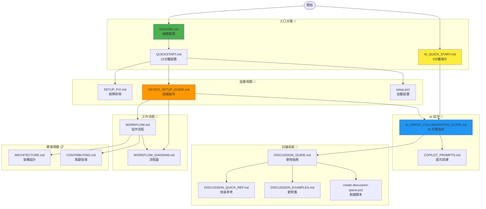

# 📚 文檔導航索引

快速找到你需要的文檔！

---

## 🚀 我該從哪裡開始？

### 🌟 完全新手（從未使用過這個系統）

```
開始這裡 ⭐
│
├─ 1️⃣ [5 分鐘 AI 快速演示](AI_QUICK_START.md)
│   └─ 立即體驗 AI 協作效果，無需完整設置
│
├─ 2️⃣ [快速開始指南](QUICKSTART.md)
│   └─ 15 分鐘完成環境設置
│
└─ 3️⃣ [設備操作詳細指南](DEVICE_SETUP_GUIDE.md)
    └─ 了解不同設備的具體操作
```

### ⚡ 已經設置好環境（想立即開始開發）

```
直接開始 🚀
│
├─ 1️⃣ [AI Agent 協作完整指南](AI_AGENT_COLLABORATION_GUIDE.md)
│   └─ 學習如何使用 AI 進行自動開發
│
├─ 2️⃣ [3 設備協作流程圖](WORKFLOW_DIAGRAM.md)
│   └─ 視覺化理解工作流程
│
└─ 3️⃣ [討論空間快速參考](DISCUSSION_QUICK_REF.md)
    └─ 常用命令速查
```

### 🔧 遇到問題（需要解決具體問題）

```
故障排除 🔧
│
├─ 設置問題 → [設置修復指南](SETUP_FIX.md)
│
├─ 不知道如何操作 → [設備操作詳細指南](DEVICE_SETUP_GUIDE.md)
│
└─ 需要範例 → [討論範例集](DISCUSSION_EXAMPLES.md)
```

---

## 📖 按主題瀏覽

### 📁 專案文檔

| 文檔 | 用途 | 時間 | 難度 |
|------|------|------|------|
| [README](README.md) | 總體概覽和入門 | 10 分鐘 | ⭐ |
| [文檔導航索引](DOCS_INDEX.md) | 快速找到所需文檔 | 5 分鐘 | ⭐ |
| [檔案結構說明](FILE_STRUCTURE.md) | 了解所有檔案用途 | 10 分鐘 | ⭐ |

### 🎯 環境設置

| 文檔 | 用途 | 時間 | 難度 |
|------|------|------|------|
| [README](README.md) | 總體概覽和入門 | 10 分鐘 | ⭐ |
| [快速開始指南](QUICKSTART.md) | 15 分鐘完成設置 | 15 分鐘 | ⭐⭐ |
| [設置修復指南](SETUP_FIX.md) | 手動安裝和故障排除 | 20 分鐘 | ⭐⭐⭐ |
| 自動化腳本 `setup.ps1` | 自動環境配置（有編碼問題） | 5 分鐘 | ⭐ |

### 🤖 AI 協作

| 文檔 | 用途 | 時間 | 難度 |
|------|------|------|------|
| [5 分鐘 AI 快速演示](AI_QUICK_START.md) ⚡ | 立即體驗 AI 協作 | 5 分鐘 | ⭐ |
| [AI Agent 協作完整指南](AI_AGENT_COLLABORATION_GUIDE.md) | 深入學習 AI 開發 | 30 分鐘 | ⭐⭐⭐ |
| [Copilot 提示詞庫](COPILOT_PROMPTS.md) | 精選提示詞模板 | 10 分鐘 | ⭐⭐ |

### 👥 多設備協作

| 文檔 | 用途 | 時間 | 難度 |
|------|------|------|------|
| [設備操作詳細指南](DEVICE_SETUP_GUIDE.md) | 3 設備具體操作流程 | 20 分鐘 | ⭐⭐ |
| [3 設備協作流程圖](WORKFLOW_DIAGRAM.md) | 視覺化協作流程 | 15 分鐘 | ⭐⭐ |
| [工作流程指南](WORKFLOW.md) | Git Flow 和協作模式 | 25 分鐘 | ⭐⭐⭐ |

### 💬 討論空間系統

| 文檔 | 用途 | 時間 | 難度 |
|------|------|------|------|
| [討論空間完整指南](DISCUSSION_GUIDE.md) | 詳細使用說明 | 25 分鐘 | ⭐⭐ |
| [討論空間快速參考](DISCUSSION_QUICK_REF.md) | 命令速查表 | 5 分鐘 | ⭐ |
| [討論範例集](DISCUSSION_EXAMPLES.md) | 5 個真實範例 | 20 分鐘 | ⭐⭐ |
| 自動化腳本 `create-discussion-space.ps1` | 自動創建討論空間 | 2 分鐘 | ⭐ |

### 🏗️ 專案結構和規範

| 文檔 | 用途 | 時間 | 難度 |
|------|------|------|------|
| [架構指南](ARCHITECTURE.md) | 專案架構和設計模式 | 30 分鐘 | ⭐⭐⭐ |
| [貢獻指南](CONTRIBUTING.md) | 代碼風格和提交規範 | 15 分鐘 | ⭐⭐ |

---

## 🎯 按場景查找

### 場景 1：我是團隊負責人，要設置整個系統

```
你需要的文檔：

1. [README](README.md) - 理解整體架構
2. [快速開始指南](QUICKSTART.md) - 為 3 台設備設置環境
3. [設備操作詳細指南](DEVICE_SETUP_GUIDE.md) - 分配角色和職責
4. [工作流程指南](WORKFLOW.md) - 建立團隊協作流程
5. [討論空間完整指南](DISCUSSION_GUIDE.md) - 設置討論系統

估計時間：2-3 小時
```

### 場景 2：我負責後端開發（設備 B）

```
你需要的文檔：

1. [5 分鐘 AI 快速演示](AI_QUICK_START.md) - 快速上手
2. [設備操作詳細指南](DEVICE_SETUP_GUIDE.md) - 查看「設備 B」部分
3. [AI Agent 協作完整指南](AI_AGENT_COLLABORATION_GUIDE.md) - 學習 AI 生成後端代碼
4. [討論空間快速參考](DISCUSSION_QUICK_REF.md) - 日常命令

日常使用：
- 每天早上查看討論空間
- 使用 AI 生成代碼
- 創建 PR 並等待審查
```

### 場景 3：我負責前端開發（設備 C）

```
你需要的文檔：

1. [5 分鐘 AI 快速演示](AI_QUICK_START.md) - 快速上手
2. [設備操作詳細指南](DEVICE_SETUP_GUIDE.md) - 查看「設備 C」部分
3. [AI Agent 協作完整指南](AI_AGENT_COLLABORATION_GUIDE.md) - 學習 AI 生成前端代碼
4. [討論空間快速參考](DISCUSSION_QUICK_REF.md) - 日常命令

日常使用：
- 每天早上查看討論空間
- 使用 AI 生成 UI 組件
- 創建 PR 並等待審查
```

### 場景 4：我負責架構和審查（設備 A）

```
你需要的文檔：

1. [README](README.md) - 全局視角
2. [設備操作詳細指南](DEVICE_SETUP_GUIDE.md) - 查看「設備 A」部分
3. [AI Agent 協作完整指南](AI_AGENT_COLLABORATION_GUIDE.md) - 使用 AI 進行代碼審查
4. [架構指南](ARCHITECTURE.md) - 理解設計決策
5. [討論範例集](DISCUSSION_EXAMPLES.md) - 查看 ADR 範例

日常使用：
- 創建和管理討論空間
- 使用 AI 分析需求
- 審查其他設備的 PR
- 做出架構決策（ADR）
```

### 場景 5：遇到設置問題

```
故障排除流程：

1. [設置修復指南](SETUP_FIX.md) - 常見問題和解決方案
   ├─ setup.ps1 執行錯誤 → 手動安裝步驟
   ├─ 編碼問題 → UTF-8 設置方法
   └─ npm 安裝失敗 → 依賴問題排查

2. 如果還是無法解決：
   └─ 查看 README 的「常見問題」部分
```

### 場景 6：需要範例和模板

```
範例文檔：

需求分析範例
└─ [討論範例集](DISCUSSION_EXAMPLES.md) → 功能提案範例

技術討論範例
└─ [討論範例集](DISCUSSION_EXAMPLES.md) → JWT 認證討論

架構決策範例
└─ [討論範例集](DISCUSSION_EXAMPLES.md) → 資料庫選擇 ADR

Bug 排查範例
└─ [討論範例集](DISCUSSION_EXAMPLES.md) → 記憶體洩漏排查

會議記錄範例
└─ [討論範例集](DISCUSSION_EXAMPLES.md) → Sprint 規劃會議

AI 提示詞範例
└─ [Copilot 提示詞庫](COPILOT_PROMPTS.md) → 各類提示詞模板
```

---

## 📊 文檔關係圖



---

## 🔍 快速搜索

### 我想找...

| 關鍵詞 | 去這裡 |
|--------|--------|
| 快速開始 | [AI_QUICK_START.md](AI_QUICK_START.md) 或 [QUICKSTART.md](QUICKSTART.md) |
| AI 如何使用 | [AI_AGENT_COLLABORATION_GUIDE.md](AI_AGENT_COLLABORATION_GUIDE.md) |
| 設備怎麼操作 | [DEVICE_SETUP_GUIDE.md](DEVICE_SETUP_GUIDE.md) |
| 討論空間 | [DISCUSSION_GUIDE.md](DISCUSSION_GUIDE.md) |
| 命令速查 | [DISCUSSION_QUICK_REF.md](DISCUSSION_QUICK_REF.md) |
| 範例參考 | [DISCUSSION_EXAMPLES.md](DISCUSSION_EXAMPLES.md) |
| 流程圖 | [WORKFLOW_DIAGRAM.md](WORKFLOW_DIAGRAM.md) |
| 問題解決 | [SETUP_FIX.md](SETUP_FIX.md) |
| Git 工作流程 | [WORKFLOW.md](WORKFLOW.md) |
| 架構設計 | [ARCHITECTURE.md](ARCHITECTURE.md) |
| 代碼規範 | [CONTRIBUTING.md](CONTRIBUTING.md) |
| 提示詞模板 | [COPILOT_PROMPTS.md](COPILOT_PROMPTS.md) |

---

## 📱 行動清單

### ✅ 第一次使用

```
□ 閱讀 README.md（10 分鐘）
□ 完成快速開始設置（15 分鐘）
□ 嘗試 5 分鐘 AI 演示（5 分鐘）
□ 閱讀你的設備操作指南（15 分鐘）
□ 創建第一個討論空間（5 分鐘）
□ 使用 AI 生成第一段代碼（10 分鐘）

總時間：約 1 小時
```

### ⚡ 日常使用

```
每天早上：
□ git pull 拉取最新代碼
□ 查看討論空間的新討論
□ 閱讀團隊的更新

開發過程：
□ 參考 AI Agent 指南使用 AI
□ 查看討論快速參考使用命令
□ 需要時參考範例集

每天結束：
□ 提交代碼並創建 PR
□ 更新討論記錄
□ git push 推送更改
```

---

## 💡 閱讀建議

### 📚 深度學習路徑（適合團隊負責人）

```
第 1 週：基礎設置
├─ Day 1: README + QUICKSTART
├─ Day 2: DEVICE_SETUP_GUIDE + WORKFLOW
├─ Day 3: AI_AGENT_COLLABORATION_GUIDE
├─ Day 4: DISCUSSION_GUIDE + DISCUSSION_EXAMPLES
└─ Day 5: ARCHITECTURE + CONTRIBUTING

第 2 週：實踐
├─ 設置 3 設備環境
├─ 創建第一個專案
├─ 建立討論空間
├─ 使用 AI 開發第一個功能
└─ 優化工作流程
```

### ⚡ 快速入門路徑（適合開發者）

```
1 小時速成：
├─ 15 分鐘: AI_QUICK_START.md
├─ 20 分鐘: DEVICE_SETUP_GUIDE.md（只看自己的設備部分）
├─ 15 分鐘: DISCUSSION_QUICK_REF.md
└─ 10 分鐘: 嘗試實際操作

之後根據需要查閱其他文檔
```

---

## 🎓 最佳實踐

### 📖 如何有效使用這些文檔

1. **不要一次讀完所有文檔** - 根據需要查閱
2. **先看快速演示** - 5 分鐘了解系統能做什麼
3. **實踐中學習** - 邊做邊查閱文檔
4. **書籤常用文檔** - 快速參考和範例集
5. **定期回顧** - 每週看一次完整指南學習新技巧

### 🔖 建議書籤

日常開發必備：
- [AI_QUICK_START.md](AI_QUICK_START.md) - 常用 AI 命令
- [DISCUSSION_QUICK_REF.md](DISCUSSION_QUICK_REF.md) - 命令速查
- [COPILOT_PROMPTS.md](COPILOT_PROMPTS.md) - 提示詞模板

偶爾參考：
- [DISCUSSION_EXAMPLES.md](DISCUSSION_EXAMPLES.md) - 需要範例時
- [SETUP_FIX.md](SETUP_FIX.md) - 遇到問題時

---

## 📞 需要幫助？

找不到你需要的信息？

1. **搜索關鍵詞** - 使用上面的快速搜索表
2. **查看範例** - [討論範例集](DISCUSSION_EXAMPLES.md) 有豐富的實例
3. **問 AI** - 在 VSCode 中使用 `@workspace` 詢問 Copilot
4. **查看故障排除** - [設置修復指南](SETUP_FIX.md)

---

**提示：** 把這個頁面加入書籤，隨時快速找到你需要的文檔！🔖

---

**最後更新：** 2026年3月2日

[返回 README](README.md)
