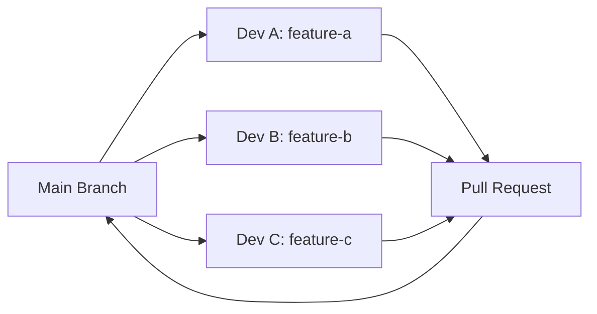

# 多設備 GitHub Copilot AI Agent 協作開發指南

本指南說明如何在3台設備上使用3個不同的 GitHub 賬號，透過 VSCode GitHub Copilot AI Agent 進行自動討論和協作開發。

> 📚 **找不到你需要的文檔？** 查看 **[文檔導航索引](DOCS_INDEX.md)** 快速找到所有資源！  
> 📁 **想了解檔案結構？** 查看 **[檔案結構說明](FILE_STRUCTURE.md)** 了解每個檔案的用途！

## 📋 目錄

- [前置準備](#前置準備)
- [設備設置](#設備設置)
- [GitHub Copilot 配置](#github-copilot-配置)
- [AI Agent 協作工作流程](#ai-agent-協作工作流程)
- [討論空間管理](#討論空間管理)
- [最佳實踐](#最佳實踐)
- [常見問題](#常見問題)
- [額外資源](#額外資源)

## ✨ 核心功能

本協作框架提供：
- 🤝 **3 設備同步開發** - 使用不同 GitHub 賬號協同工作
- 🤖 **AI Agent 輔助** - GitHub Copilot 自動代碼審查、生成和建議
- 💬 **討論空間系統** - 自動為不同專案創建結構化討論空間
- 📝 **完整文檔** - 從設置到工作流程的詳盡指南
- ⚡ **自動化腳本** - PowerShell 腳本自動化環境配置和討論管理

**快速開始：**
- 🚀 **[5 分鐘 AI 快速演示](AI_QUICK_START.md)** - 立即體驗 AI 自動協作！⚡
- 新用戶請閱讀 **[快速開始指南](QUICKSTART.md)** (15 分鐘設置)
- 不同設備操作請查看 **[設備操作詳細指南](DEVICE_SETUP_GUIDE.md)** ⭐
- AI 自動協作請參考 **[AI Agent 協作指南](AI_AGENT_COLLABORATION_GUIDE.md)** 🤖⭐
- 討論空間使用請參考 **[討論空間完整指南](DISCUSSION_GUIDE.md)**
- 查詢常用命令請看 **[討論空間快速參考](DISCUSSION_QUICK_REF.md)**

---

## 🎯 前置準備

### 1. GitHub 賬號準備

確保每個賬號都具備：
- ✅ 有效的 GitHub 賬號
- ✅ GitHub Copilot 訂閱（個人版或企業版）
- ✅ 對共享儲存庫的訪問權限

**賬號規劃範例：**
```
設備 A → GitHub 賬號 1 (developer1@example.com)
設備 B → GitHub 賬號 2 (developer2@example.com)
設備 C → GitHub 賬號 3 (developer3@example.com)
```

### 2. 軟體需求

每台設備需安裝：
- **VSCode** (最新版本)
- **GitHub Copilot Extension**
- **GitHub Copilot Chat Extension**
- **Git** (2.x 或更高版本)

## 🖥️ 設備設置

### 設備 A、B、C 各自設置步驟

#### 步驟 1: 安裝 VSCode 擴展

```bash
# 方法一：透過 VSCode 擴展市場搜尋並安裝
# - GitHub Copilot
# - GitHub Copilot Chat

# 方法二：透過命令行安裝
code --install-extension GitHub.copilot
code --install-extension GitHub.copilot-chat
```

#### 步驟 2: Git 配置

每台設備需配置各自的 Git 身份：

**設備 A:**
```bash
git config --global user.name "Developer 1"
git config --global user.email "developer1@example.com"
```

**設備 B:**
```bash
git config --global user.name "Developer 2"
git config --global user.email "developer2@example.com"
```

**設備 C:**
```bash
git config --global user.name "Developer 3"
git config --global user.email "developer3@example.com"
```

#### 步驟 3: GitHub 認證

每台設備分別登入各自的 GitHub 賬號：

1. 開啟 VSCode
2. 點擊左下角的帳戶圖示
3. 選擇 "Sign in to Sync Settings"
4. 選擇 "Sign in with GitHub"
5. 在瀏覽器中使用對應的 GitHub 賬號登入
6. 授權 GitHub Copilot 訪問權限

## ⚙️ GitHub Copilot 配置

### VSCode 設定檔配置

在每台設備的 VSCode 中設置（`settings.json`）：

```json
{
  "github.copilot.enable": {
    "*": true
  },
  "github.copilot.advanced": {
    "debug.overrideEngine": "claude-sonnet-4.5",
    "authProvider": "github"
  },
  "github.copilot.chat.followUpAutoClose": false,
  "workbench.activityBar.visible": true,
  "editor.inlineSuggest.enabled": true,
  "editor.formatOnSave": true
}
```

### 工作區設定

在專案根目錄創建 `.vscode/settings.json`：

```json
{
  "github.copilot.enable": {
    "*": true,
    "yaml": true,
    "plaintext": false,
    "markdown": true
  },
  "editor.suggest.preview": true,
  "editor.quickSuggestions": {
    "comments": true,
    "strings": true,
    "other": true
  }
}
```

## 🤖 AI Agent 協作工作流程

### 方案一：分支開發協作流程

這是最推薦的多人協作方式：



**實施步驟：**

1. **設備 A - 功能開發者**
```bash
# 克隆儲存庫
git clone https://github.com/your-org/your-repo.git
cd your-repo

# 創建並切換到功能分支
git checkout -b feature-authentication

# 使用 Copilot Agent 進行開發
# 在 VSCode Chat 中輸入：
# "@workspace 請幫我實作用戶認證功能，包含登入、註冊和 JWT token 驗證"

# 提交更改
git add .
git commit -m "feat: implement user authentication"
git push origin feature-authentication

# 創建 Pull Request
```

2. **設備 B - 代碼審查者**
```bash
# 拉取最新代碼
git fetch origin
git checkout feature-authentication

# 使用 Copilot Agent 進行代碼審查
# 在 VSCode Chat 中輸入：
# "@workspace 請審查這個分支的代碼品質、安全性和最佳實踐"

# 在 GitHub 上進行 Pull Request 審查並提供意見
```

3. **設備 C - 整合測試者**
```bash
# 創建測試分支
git checkout -b integration-tests

# 使用 Copilot Agent 生成測試
# 在 VSCode Chat 中輸入：
# "@workspace 請為 feature-authentication 分支的代碼生成完整的單元測試和整合測試"

# 提交測試代碼
git add .
git commit -m "test: add authentication tests"
git push origin integration-tests
```

### 方案二：基於 Issue 的協作

使用 GitHub Issues 和 Projects 進行任務分配：

**工作流程：**

1. **在 GitHub 上創建 Issues**
   - Issue #1: 實作用戶認證 (分配給設備 A)
   - Issue #2: 設計資料庫架構 (分配給設備 B)
   - Issue #3: 建立 API 文檔 (分配給設備 C)

2. **各設備使用 Copilot Agent 開發**

**設備 A:**
```bash
git checkout -b issue-1-user-auth
# VSCode Chat: "@workspace 根據 Issue #1 的需求實作用戶認證，參考 #authentication #security"
```

**設備 B:**
```bash
git checkout -b issue-2-database-schema
# VSCode Chat: "@workspace 設計資料庫架構，支援用戶認證和角色管理"
```

**設備 C:**
```bash
git checkout -b issue-3-api-docs
# VSCode Chat: "@workspace 為認證 API 生成 OpenAPI 文檔"
```

### 方案三：即時協作（Live Share）

使用 VSCode Live Share 進行即時協作：

1. **安裝 Live Share 擴展**
```bash
code --install-extension MS-vsliveshare.vsliveshare
```

2. **主持人（設備 A）分享會話**
   - 點擊底部狀態欄 "Live Share"
   - 點擊 "Start collaboration session"
   - 分享連結給其他開發者

3. **參與者（設備 B、C）加入會話**
   - 點擊 "Join collaboration session"
   - 輸入會話連結

4. **在共享會話中使用 Copilot**
   - 每個參與者都可以使用自己的 Copilot
   - 在聊天中討論並即時協作開發
   - 使用 "@workspace" 進行全局代碼理解

## � 討論空間管理

本框架提供自動化的討論空間管理系統，為不同專案創建結構化的討論環境。

### 快速創建討論空間

使用 PowerShell 腳本快速創建：

```powershell
# 為新專案創建討論空間
.\create-discussion-space.ps1 -ProjectName "user-auth-system"

# 腳本會自動創建：
# - 7 個討論類別目錄（general, ideas, technical, architecture, troubleshooting, decisions, meetings）
# - 每個類別的 README 說明
# - 3 個助手腳本（new-discussion.ps1, search-discussion.ps1, stats.ps1）
```

### 討論類別說明

| 類別 | 用途 | 範例 |
|------|------|------|
| 📋 general | 一般討論和公告 | 專案進度更新、團隊公告 |
| 💡 ideas | 功能提案和創意討論 | 新功能建議、改進意見 |
| 🔧 technical | 技術實作討論 | API 設計、演算法選擇 |
| 🏗️ architecture | 架構設計和決策記錄 | 系統架構、技術選型 ADR |
| 🐛 troubleshooting | 問題排查和解決方案 | Bug 調查、效能問題 |
| 📌 decisions | 重要決策記錄 | 技術決策、流程變更 |
| 🗓️ meetings | 會議記錄 | Sprint Planning、Retrospective |

### 使用助手腳本

每個專案的討論空間都會自動生成 3 個助手腳本：

```powershell
# 創建新討論
cd discussions\user-auth-system
.\new-discussion.ps1 -Category technical -Title "JWT 認證實作方式"

# 搜尋討論
.\search-discussion.ps1 -Keyword "JWT"
.\search-discussion.ps1 -Keyword "認證" -Category technical

# 查看統計
.\stats.ps1
```

### 與 Copilot 集成

討論文件與 Copilot 完美集成：

```
# 加載討論上下文進行開發
@workspace 根據 discussions/user-auth-system/technical/2026-03-02-jwt-authentication-implementation.md
中的決議實作 JWT 認證

# 基於討論生成代碼
結合討論中的技術方案，為我生成 JWT middleware 實作

# 審查討論內容
檢查這個技術討論是否有遺漏的風險點
```

### 完整文檔

- **[討論空間完整指南](DISCUSSION_GUIDE.md)** - 500+ 行完整指南，涵蓋所有功能和最佳實踐
- **[討論空間快速參考](DISCUSSION_QUICK_REF.md)** - 常用命令和模板速查
- **[討論範例集](DISCUSSION_EXAMPLES.md)** - 5 個真實案例範例（技術討論、架構決策、問題排查、會議記錄、功能提案）

## �💡 最佳實踐

### 1. 使用 Copilot Agent 進行代碼討論

**在 VSCode Chat 中進行討論：**

```
設備 A: "@workspace 我正在實作登入功能，請建議最佳的身份驗證流程"
Copilot: [提供建議]

設備 B: "@workspace 請分析當前的身份驗證實作，是否符合 OWASP 安全標準"
Copilot: [進行安全分析]

設備 C: "@workspace 基於上述實作，請生成對應的測試案例"
Copilot: [生成測試]
```

### 2. 代碼審查流程

使用 Copilot 協助代碼審查：

```
# 在 Pull Request 的文件中
右鍵 → "Copilot" → "Review Code"
或在 Chat 中輸入：
"@workspace 請審查這個 PR 的更改，重點關注：
1. 代碼品質
2. 安全漏洞
3. 性能問題
4. 測試覆蓋率"
```

### 3. 協作溝通標準

在 commit message 和 PR 中使用清晰的標識：

```bash
# Commit message 格式
feat(auth): [Dev A] add JWT authentication
fix(db): [Dev B] resolve connection pool issue
test(api): [Dev C] add integration tests

# PR 標題格式
[Dev A] Feature: User Authentication System
[Dev B] Fix: Database Connection Issues
[Dev C] Test: API Integration Test Suite
```

### 4. 使用 GitHub Projects 進行任務管理

創建 Project Board：

```
TODO          | IN PROGRESS        | REVIEW         | DONE
------------- | ------------------ | -------------- | ---------------
Issue #4      | Issue #1 (Dev A)   | Issue #2       | Issue #3
Feature X     | Feature Y (Dev B)  | Feature Z      | Feature W
              | Bug Fix (Dev C)    |                |
```

## 🔧 開發環境同步

### 使用 Settings Sync

**注意：** 每個設備應使用各自的 GitHub 賬號進行 Settings Sync，避免配置衝突。

#### 同步項目建議：
- ✅ 工作區設定（workspace settings）
- ✅ 擴展清單
- ✅ 代碼片段（snippets）
- ❌ 個人賬號資訊（自動隔離）

### 統一開發環境配置

創建 `.devcontainer/devcontainer.json` 確保開發環境一致：

```json
{
  "name": "Team Development",
  "image": "mcr.microsoft.com/devcontainers/typescript-node:18",
  "customizations": {
    "vscode": {
      "extensions": [
        "GitHub.copilot",
        "GitHub.copilot-chat",
        "dbaeumer.vscode-eslint",
        "esbenp.prettier-vscode"
      ]
    }
  },
  "postCreateCommand": "npm install",
  "remoteUser": "node"
}
```

## ❓ 常見問題

### Q1: 三個賬號如何共享 Copilot 建議？

**A:** Copilot 的建議是基於代碼上下文的，不同賬號在相同的代碼庫中會獲得相似的建議。透過 Git 分享代碼，所有開發者都能在相同的基礎上使用 Copilot。

### Q2: 如何避免不同設備上的配置衝突？

**A:**
1. 使用項目級別的 `.vscode/settings.json` 統一配置
2. 個人設定用 User Settings，團隊設定用 Workspace Settings
3. 使用 `.gitignore` 排除個人化配置文件

### Q3: 可以同時編輯同一個文件嗎？

**A:**
- 使用 Git 分支：每個開發者在自己的分支上工作（推薦）
- 使用 Live Share：可以即時協作編輯同一文件
- 使用代碼審查：透過 PR 合併不同的更改

### Q4: Copilot Agent 能否記住團隊的討論？

**A:** Copilot 本身不會跨會話記住討論內容，但您可以：
- 在代碼註釋中記錄決策
- 在 GitHub Issues 中記錄討論
- 使用 CHANGELOG.md 記錄重要變更
- 建立 DECISION.md 記錄架構決策

### Q5: 如何處理 Copilot 給出的不一致建議？

**A:**
1. 建立團隊代碼規範（`.eslintrc`, `.prettierrc`）
2. 使用一致的提示詞（prompts）
3. 在 PR 審查中統一代碼風格
4. 建立項目級別的設定檔

## 📚 額外資源

### GitHub Copilot Chat 常用指令

```
# 代碼理解
@workspace 解釋這個專案的架構

# 代碼生成
@workspace 實作一個 REST API 端點用於用戶註冊

# 代碼審查
@workspace 審查這個文件的代碼品質

# 測試生成
@workspace 為這個函數生成單元測試

# 重構建議
@workspace 建議如何重構這段代碼以提高可維護性

# 文檔生成
@workspace 為這個 API 生成文檔
```

### 討論空間文檔

本框架提供了強大的討論空間管理系統，用於多專案協作：

- **[文檔導航索引](DOCS_INDEX.md)** 📚 - 快速找到你需要的所有文檔！
- **[檔案結構說明](FILE_STRUCTURE.md)** 📁 - 了解每個檔案和目錄的用途
- **[5 分鐘 AI 快速演示](AI_QUICK_START.md)** ⚡ - 立即體驗 AI 自動協作的實際效果！
- **[3 設備協作流程圖](WORKFLOW_DIAGRAM.md)** 📊 - 視覺化展示協作流程和時間規劃
- **[AI Agent 協作完整指南](AI_AGENT_COLLABORATION_GUIDE.md)** - 如何使用 AI 進行自動討論和開發
- **[設備操作詳細指南](DEVICE_SETUP_GUIDE.md)** - 3 設備的具體操作流程
- **[討論空間完整指南](DISCUSSION_GUIDE.md)** - 詳細說明討論空間的使用方法、類別、工作流程和最佳實踐
- **[討論空間快速參考](DISCUSSION_QUICK_REF.md)** - 常用命令和模板快速查詢
- **[討論範例集](DISCUSSION_EXAMPLES.md)** - 5 個真實世界的討論範例（技術討論、架構決策、問題排查、會議記錄、功能提案）
- **[Copilot 提示詞庫](COPILOT_PROMPTS.md)** - 精選的 AI 提示詞模板

**快速創建討論空間：**
```powershell
# 為新專案創建討論空間
.\create-discussion-space.ps1 -ProjectName "my-project"

# 使用生成的助手腳本
cd discussions\my-project
.\new-discussion.ps1 -Category technical -Title "實作JWT認證"
.\search-discussion.ps1 -Keyword "認證"
.\stats.ps1  # 查看討論統計
```

### 推薦的協作工具

- **GitHub Projects**: 任務管理和追蹤
- **GitHub Actions**: CI/CD 自動化
- **VSCode Live Share**: 即時協作編輯
- **GitHub Discussions**: 團隊討論和知識分享
- **Discord/Slack**: 即時通訊（整合 GitHub 通知）

## 🚀 快速開始範例

以下是一個完整的協作流程範例：

### 第 1 天：專案初始化（設備 A）

```bash
# 創建新專案
mkdir team-project
cd team-project
git init
npm init -y

# 創建基礎結構
# 在 VSCode Chat 中：
# "@workspace 請為一個 Node.js Express API 專案創建標準的目錄結構"

# 提交並推送到 GitHub
git add .
git commit -m "init: project structure"
git remote add origin https://github.com/your-org/team-project.git
git push -u origin main
```

### 第 2 天：功能開發（設備 B）

```bash
# 克隆並創建功能分支
git clone https://github.com/your-org/team-project.git
cd team-project
git checkout -b feature-user-api

# 在 VSCode Chat 中：
# "@workspace 實作用戶 CRUD API，使用 Express 和 MongoDB"

# 提交並創建 PR
git add .
git commit -m "feat: implement user CRUD API"
git push origin feature-user-api
# 在 GitHub 上創建 Pull Request
```

### 第 3 天：測試和審查（設備 C）

```bash
# 拉取並審查代碼
git fetch origin
git checkout feature-user-api

# 在 VSCode Chat 中：
# "@workspace 審查 feature-user-api 分支的代碼，並生成對應的測試"

# 創建測試分支
git checkout -b test-user-api
# 添加測試檔案後提交
git add .
git commit -m "test: add user API tests"
git push origin test-user-api
```

### 第 4 天：整合和部署（所有設備）

```bash
# 設備 A: 合併 PR 後拉取最新代碼
git checkout main
git pull origin main

# 運行協作測試
npm test

# 部署到生產環境
# 在 VSCode Chat 中：
# "@workspace 生成 GitHub Actions workflow 用於自動部署"
```

## 📝 協作檢查清單

部署前確認：

- [ ] 所有開發者已在各自設備上正確配置 GitHub 賬號
- [ ] 所有開發者已安裝並啟用 GitHub Copilot
- [ ] 創建共享的 Git 儲存庫並設定正確的權限
- [ ] 定義代碼風格和提交規範
- [ ] 設定 CI/CD pipeline
- [ ] 建立分支保護規則
- [ ] 創建 PR 審查流程
- [ ] 定期同步和溝通

---

## 📧 支援

如有問題，請聯繫團隊負責人或查閱：
- [GitHub Copilot 官方文檔](https://docs.github.com/copilot)
- [VSCode 協作指南](https://code.visualstudio.com/docs/editor/github)
- [Git 協作工作流程](https://git-scm.com/book/en/v2/Distributed-Git-Distributed-Workflows)

---

**最後更新:** 2026年3月2日
