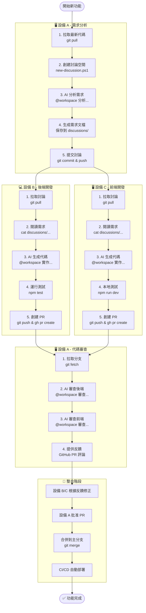
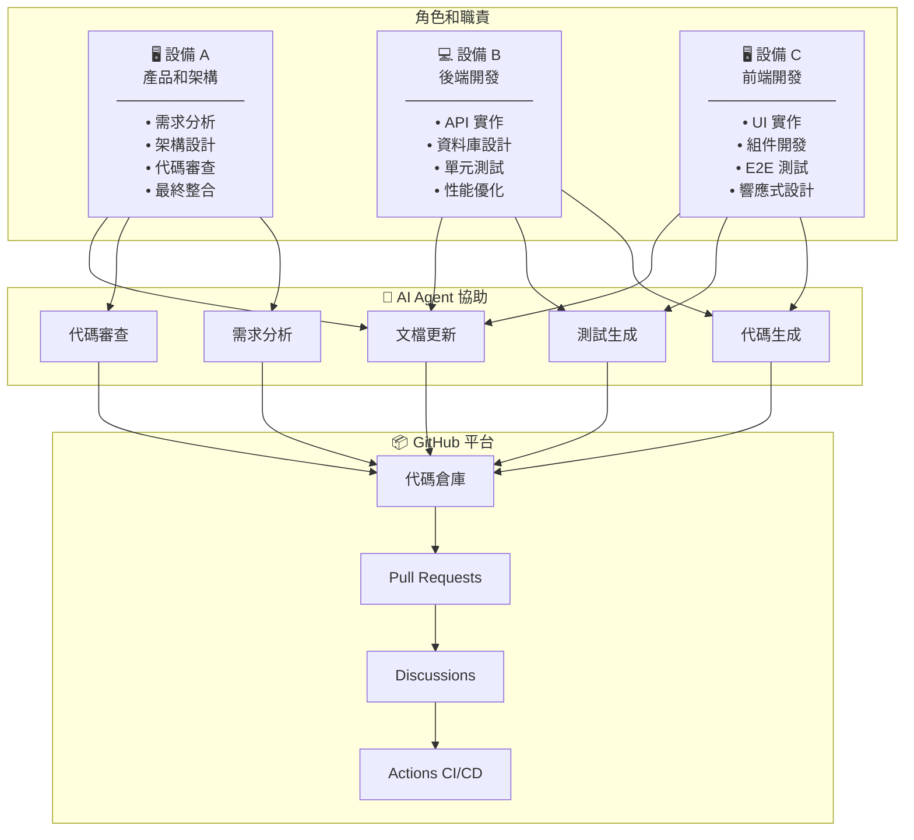
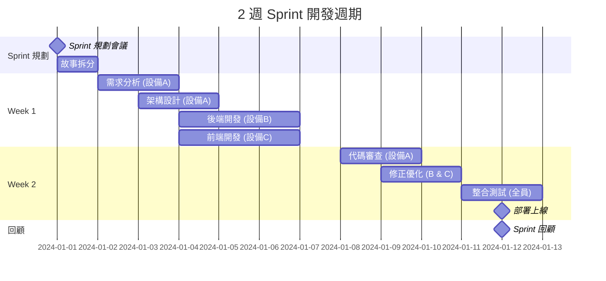
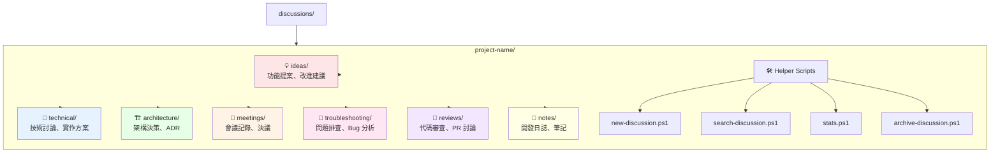
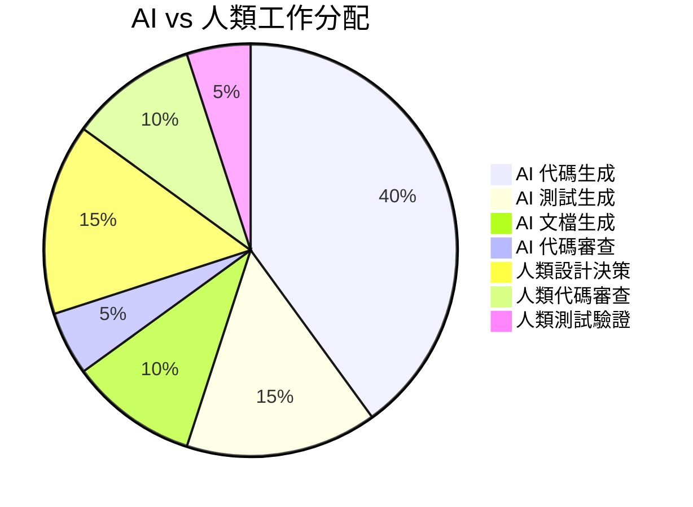

# 3 設備 AI 協作工作流程圖

本文檔使用視覺化方式展示 3 台設備如何使用 GitHub Copilot AI Agent 進行協作開發。

---

## 📊 完整協作流程圖



---

## 🔄 AI 輔助的代碼生命週期

```mermaid
graph LR
    subgraph Stage1["階段 1: 需求"]
        R1[📝 需求討論]
        R2[🤖 AI 分析]
        R3[📄 生成規格]
    end

    subgraph Stage2["階段 2: 設計"]
        D1[🏗️ 架構討論]
        D2[🤖 AI 設計]
        D3[📐 生成 ADR]
    end

    subgraph Stage3["階段 3: 開發"]
        C1[💻 AI 生成代碼]
        C2[🧪 AI 生成測試]
        C3[🔍 人類審查]
    end

    subgraph Stage4["階段 4: 審查"]
        V1[🤖 AI 代碼審查]
        V2[👥 人類審查]
        V3[✅ 批准合併]
    end

    subgraph Stage5["階段 5: 部署"]
        P1[🚀 自動部署]
        P2[📊 監控]
        P3[📝 更新文檔]
    end

    R1 --> R2 --> R3 --> D1
    D1 --> D2 --> D3 --> C1
    C1 --> C2 --> C3 --> V1
    V1 --> V2 --> V3 --> P1
    P1 --> P2 --> P3
```



---

## 🎭 3 設備角色分配圖



---

## 🕐 典型一天的工作流程

### 設備 A（早上 9:00）

```mermaid
gantt
    title 設備 A 的一天
    dateFormat HH:mm
    axisFormat %H:%M

    section 需求分析
    拉取更新           :09:00, 10m
    與團隊討論         :09:10, 30m
    AI 分析需求        :09:40, 20m

    section 創建討論
    創建討論空間       :10:00, 10m
    撰寫需求文檔       :10:10, 30m
    提交推送           :10:40, 10m

    section 午休
    休息               :12:00, 60m

    section 代碼審查
    拉取 PR            :13:00, 10m
    AI 審查後端        :13:10, 30m
    AI 審查前端        :13:40, 30m
    提供反饋           :14:10, 20m

    section 整合
    修正反饋           :15:00, 60m
    最終測試           :16:00, 30m
    合併部署           :16:30, 30m
```



### 設備 B（早上 10:00 開始）

```mermaid
gantt
    title 設備 B 的一天
    dateFormat HH:mm
    axisFormat %H:%M

    section 準備
    拉取討論           :10:00, 10m
    閱讀需求           :10:10, 20m
    理解架構           :10:30, 20m

    section 後端開發
    創建開發分支       :10:50, 5m
    AI 生成模型        :10:55, 20m
    AI 生成路由        :11:15, 20m
    AI 生成控制器      :11:35, 25m

    section 午休
    休息               :12:00, 60m

    section 測試
    AI 生成測試        :13:00, 30m
    運行測試           :13:30, 20m
    修復錯誤           :13:50, 40m

    section 提交
    創建 PR            :14:30, 15m
    等待審查           :14:45, 75m

    section 修正
    根據反饋修正       :16:00, 60m
```



### 設備 C（早上 10:00 開始）

```mermaid
gantt
    title 設備 C 的一天
    dateFormat HH:mm
    axisFormat %H:%M

    section 準備
    拉取討論           :10:00, 10m
    閱讀需求           :10:10, 20m
    查看設計稿         :10:30, 20m

    section 前端開發
    創建開發分支       :10:50, 5m
    AI 生成組件        :10:55, 30m
    AI 生成樣式        :11:25, 20m
    AI 生成邏輯        :11:45, 15m

    section 午休
    休息               :12:00, 60m

    section 測試
    本地開發測試       :13:00, 40m
    AI 生成 E2E 測試   :13:40, 30m
    瀏覽器測試         :14:10, 20m

    section 提交
    創建 PR            :14:30, 15m
    等待審查           :14:45, 75m

    section 修正
    根據反饋修正       :16:00, 60m
```



---

## 📅 完整 Sprint 週期（2 週）



---

## 🔀 Git 分支策略圖

```mermaid
gitgraph
    commit id: "Initial"
    branch develop
    checkout develop
    commit id: "Setup project"

    branch feature/user-auth-backend
    checkout feature/user-auth-backend
    commit id: "設備B: Add user model"
    commit id: "設備B: Add auth routes"
    commit id: "設備B: Add tests"

    checkout develop
    branch feature/user-auth-frontend
    checkout feature/user-auth-frontend
    commit id: "設備C: Add login page"
    commit id: "設備C: Add signup form"
    commit id: "設備C: Add E2E tests"

    checkout develop
    merge feature/user-auth-backend tag: "PR #1 merged"
    merge feature/user-auth-frontend tag: "PR #2 merged"

    checkout main
    merge develop tag: "v1.1.0"

    checkout develop
    branch feature/payment
    checkout feature/payment
    commit id: "設備B: Payment API"
    commit id: "設備C: Payment UI"

    checkout develop
    merge feature/payment tag: "PR #3 merged"

    checkout main
    merge develop tag: "v1.2.0"
```

---

## 💬 討論空間結構圖



---

## 🤖 AI Agent 協助比重圖



---

## 📊 效率提升對比圖

### 傳統開發 vs AI 協作開發

```mermaid
gantt
    title 功能開發時間對比
    dateFormat X
    axisFormat %s

    section 傳統開發
    需求分析        :0, 4h
    設計            :4h, 4h
    後端開發        :8h, 16h
    前端開發        :8h, 16h
    測試開發        :24h, 8h
    代碼審查        :32h, 4h
    修正優化        :36h, 4h
    文檔更新        :40h, 4h

    section AI 協作開發
    AI 需求分析     :done, 0, 2h
    AI 設計輔助     :done, 2h, 2h
    AI 後端生成     :done, 4h, 4h
    AI 前端生成     :done, 4h, 4h
    AI 測試生成     :done, 8h, 2h
    AI 代碼審查     :done, 10h, 1h
    人類修正        :done, 11h, 2h
    AI 文檔生成     :done, 13h, 1h
```

**傳統開發：** 約 44 小時（5.5 天）
**AI 協作開發：** 約 14 小時（1.75 天）
**效率提升：** 約 **70%** 🚀

---

## 🎯 使用指南

### 如何閱讀這些圖表

1. **協作流程圖** - 了解整體工作流程和各設備的配合方式
2. **代碼生命週期** - 理解 AI 在每個階段的參與
3. **角色分配圖** - 明確各設備的職責
4. **時間軸圖** - 規劃你的工作時間
5. **分支策略圖** - 學習 Git 協作模式
6. **討論空間圖** - 組織你的項目討論
7. **效率對比圖** - 驗證 AI 協作的價值

### 快速開始

1. 📖 先看 **[5 分鐘 AI 快速演示](AI_QUICK_START.md)**
2. 🔧 按照 **[快速開始指南](QUICKSTART.md)** 設置環境
3. 👥 參考 **[設備操作指南](DEVICE_SETUP_GUIDE.md)** 分配角色
4. 🤖 學習 **[AI Agent 協作指南](AI_AGENT_COLLABORATION_GUIDE.md)**
5. 📝 使用 **[討論空間系統](DISCUSSION_GUIDE.md)** 管理協作

---

## 📌 關鍵要點

### ✅ 成功協作的關鍵

1. **清晰的討論記錄** - AI 需要上下文
2. **明確的角色分配** - 避免工作重複
3. **頻繁的代碼同步** - 每天至少 pull/push 一次
4. **善用 @workspace** - 讓 AI 理解整個項目
5. **人類最終審查** - AI 輔助但不替代人類判斷

### ⚡ 效率最大化技巧

- 讓 AI 做重複性工作（代碼生成、測試、文檔）
- 人類專注於創造性決策（架構、設計、審查）
- 使用討論空間作為「真相來源」
- 並行開發（後端和前端同時進行）
- 自動化一切可以自動化的流程

### 🚫 常見陷阱

- ❌ 不記錄討論和決策
- ❌ 直接使用 AI 生成的代碼而不審查
- ❌ 分支管理混亂
- ❌ 缺乏測試
- ❌ 忽視代碼品質

---

**相關文檔：**
- [返回主文檔](README.md)
- [AI 快速開始](AI_QUICK_START.md)
- [AI 協作指南](AI_AGENT_COLLABORATION_GUIDE.md)
- [設備操作指南](DEVICE_SETUP_GUIDE.md)

---

**最後更新：** 2026年3月2日
